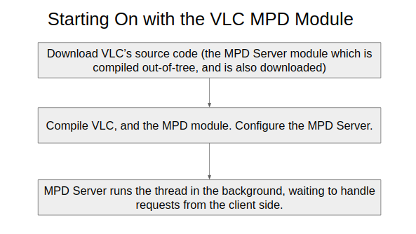
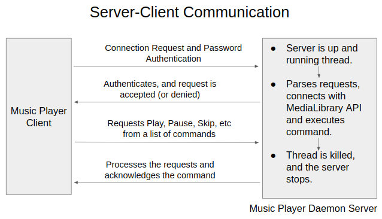

MPD Architecture & Simple C Server-Client Program for VLC command parsing
=========================================================================

### Code - C/C++ Files

*   [Server-Client Folder](./server-client/) contains a simple socket programme for Client and Socket in C language. At this time, we can send and recive basic commands like `vlc`, `vlc --version`, `vlc --help` from client, and it would be parsed and executed in server.
*   [Shell Access Folder](./shell access/) contains a simple C++ programme to access shell from a C++ file, in Ubuntu.

### MPD Architecture

#### Summary Of Proposed Tasks which are to be performed during the Summer

*   1\. Creating a basic MPD server-client architecture
*   2\. Implementing the MPD Protocols
*   3\. Parsing Client Side Request
*   4\. Connecting it with VLC media library
*   5\. Implementing Different MPD features
*   6\. Configuring Files Option
*   7\. Command line Access to the server
*   8\. Documentation & Bug Fixes

#### Basic Flow of Command while accessing VLC MPD Server Module

*   Step 1: Install VLC on your system, and along with this, the mpd module will also be installed.
*   Step 2: using a cmd line argument, initialise the MPD server (eg. vlc --mpd or something like this)
*   Step 3: Configure the MPD server using config file, putting correct paths, music directory, etc.
*   Step 4: Run the thread in the system, it should be running in the background, waiting for requests to come, and handle it.

Starting the MPD Server

  
*   Step 5: Using mpc-clients, send requests to the server.
*   Step 6: With due command processing, actions would take place, like play, pause, random, etc.
*   Step 7: Stop the server to kill the thread.

Server Client Communication

